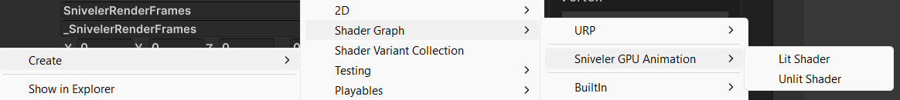
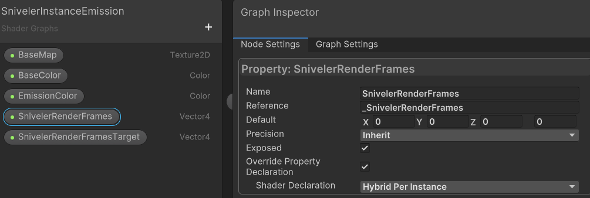

# 🎨 5. Shader Graph Integration (Custom Materials)

One of the most powerful features of **GPU Animation Entities PRO** is its native integration with Unity's Shader Graph.

Because our animation logic runs entirely in the Vertex Shader, you are completely free to customize the Fragment Shader. Want to add a dissolve effect to dying enemies? Need cel-shaded outlines? Want glowing emission maps for your sci-fi swarm? You can do it all without writing a single line of HLSL code.

There are two ways to create a custom animated material: **The Easy Way (Templates)** and **The Manual Way (Existing Shaders)**.

***

#### 🟢 Method 1: The Easy Way (Using Templates)

We provide pre-configured Shader Graph templates where the complex DOTS animation logic is already wired up for you. This is the recommended workflow.

1. In your Project window, right-click in any folder.
2. Navigate to **Create > Shader Graph > Sniveler GPU Animation**.
3. Select either **Lit Shader** or **Unlit Shader**.
4. Name your new shader (e.g., `MySwarmDissolveShader`).
5. Double-click to open it in the Shader Graph editor.

<figure><figcaption></figcaption></figure>

**What to do next:**\
Look at the graph. You will see the `SnivelerAnimationNode` already connected to the Vertex output block. **Do not modify the Vertex connections.**\
Instead, focus on the **Fragment** block. You can drag in textures, add noise nodes, multiply colors, and connect them to Base Color, Emission, or Alpha just like you would in any normal Shader Graph!

***

#### 🟠 Method 2: The Manual Way (Upgrading Existing Shaders)

If you already have a massive, complex Shader Graph and want to add GPU animation to it, you can do so in just a few steps.

**Step 1: Add the Animation Node**

1. Open your existing Shader Graph.
2. Press Spacebar to open the search menu and type `SnivelerAnimationNode`. Add this `SubGraph` to your workspace.

**Step 2: Create the DOTS Properties (🚨 CRITICAL)**

The GPU needs to know which animation frame to play. We pass this data from ECS to the shader using two specific properties.

1. Open the **Blackboard** (left panel).
2. Create a new **Vector4** property and name it exactly: `_SnivelerRenderFrames`
3. Create another **Vector4** property and name it exactly: `_SnivelerRenderFramesTarget`
4. **CRITICAL STEP:** Select each property, open the **Graph Inspector** (right panel), and check the box for **Hybrid Rendered (DOTS Instancing)**.

> 🛑 **Warning:** If you forget to check "Hybrid Rendered", the DOTS ECS system will not allocate memory for these properties. Your shader will receive zeros, and **your meshes will be completely invisible!**

<figure><figcaption></figcaption></figure>

**Step 3: Wire the Inputs**

Connect the following standard nodes into the left side of the `SnivelerAnimationNode`:

* **Position (Object Space)** -> `PositionOS`
* **Normal (Object Space)** -> `NormalOS`
* **Tangent (Object Space)** -> `TangentOS`
* **UV (Channel: UV2)** -> `BoneIndices` (This is where the Baker stores bone indices)
* **UV (Channel: UV3)** -> `BoneWeights` (This is where the Baker stores bone weights)
* Drag your `_SnivelerRenderFrames` property -> `FramesA`
* Drag your `_SnivelerRenderFramesTarget` property -> `FramesB`

**Step 4: Wire the Outputs**

Connect the right side of the `SnivelerAnimationNode` directly into your **Vertex Output Block**:

* `OutPositionOS` -> Vertex Position
* `OutNormalOS` -> Vertex Normal
* `OutTangentOS` -> Vertex Tangent

Save your asset. Your custom shader is now fully compatible with GPU Animation Entities PRO!

***

#### 🧠 Under the Hood: What about Keywords and LODs?

You might be wondering: "How do I enable Dual Quaternion Skinning (DQS) or configure LOD quality in my custom shader?"

**You don't have to do anything!**\
We designed the system for a "Zero Setup" experience. The `SnivelerAnimationNode` internally contains all the necessary keywords (`DQS`, `ANIM_STEP`, `BONE_LOD_1`, etc.). When you use this node, your shader automatically inherits these variants.

When you bake your prefab, our C# Baker script will automatically enable or disable these keywords on your generated materials based on your LOD settings.

***

#### 🔨 Applying Your Custom Shader

Once your Shader Graph is ready, you need to tell the Baker to use it:

1. Open the **Animator Baker** window.
2. Assign your source Prefab.
3. Go to the `Lods` tab.
4. Change the **Shader** dropdown from Sniveler Lit to **Custom**.
5. A new object field will appear. Drag and drop your custom Shader Graph asset here.
6. Click **Process**.

The Baker will now generate all LOD materials using your custom shader, perfectly configured for DOTS!
