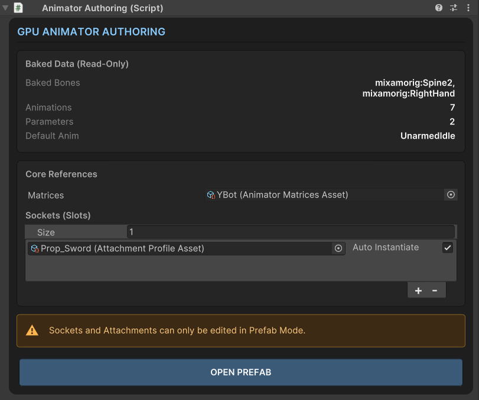
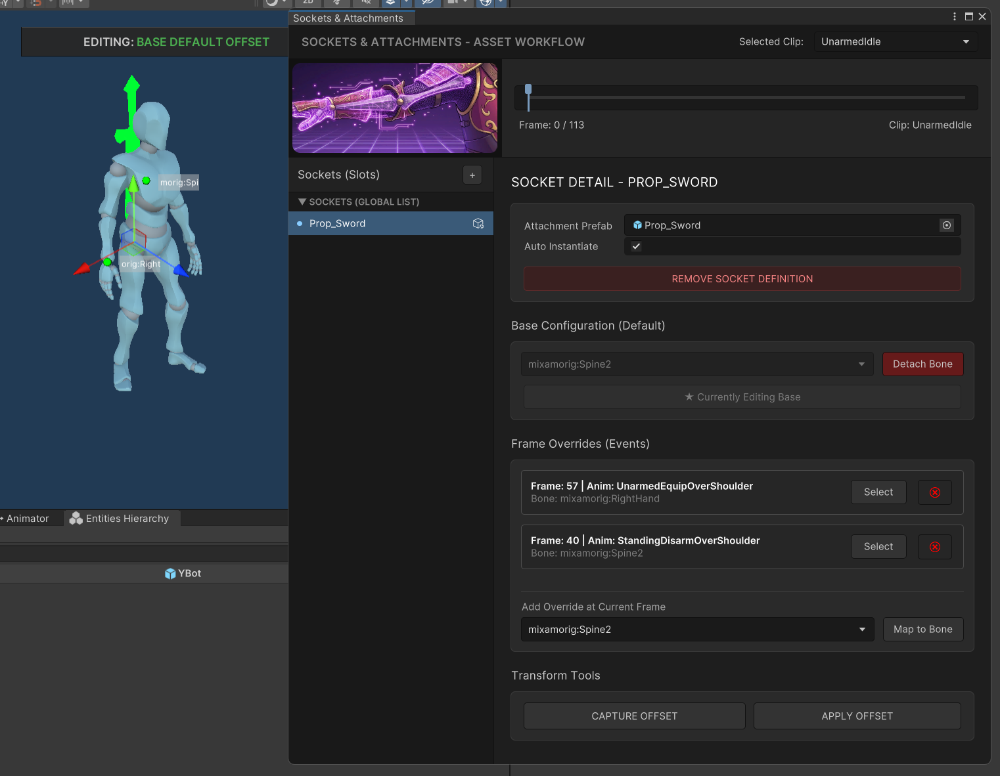
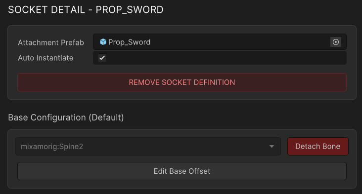
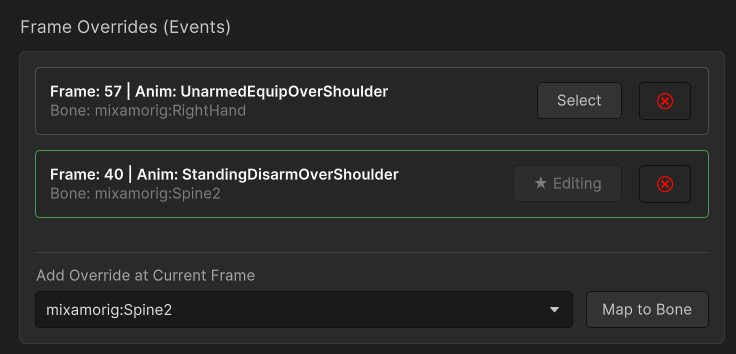
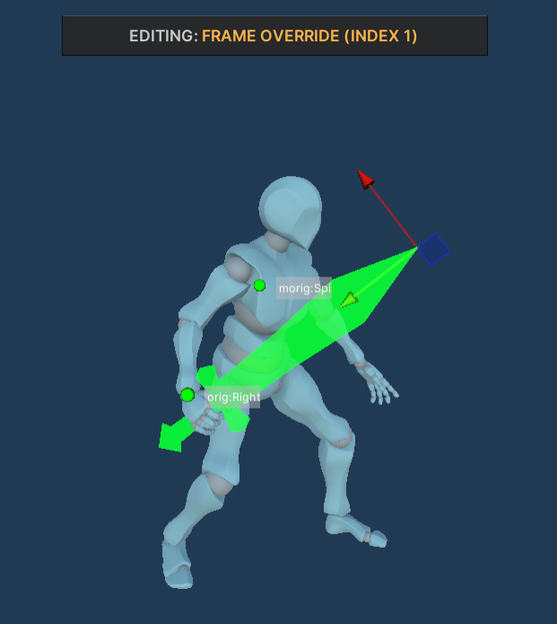
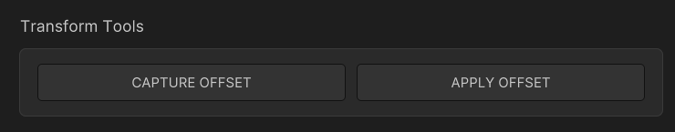
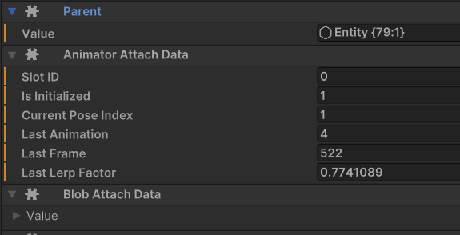

# 🔗 6. Sockets & Attachments (Weapons & VFX)

Since standard bones `GameObjects` do not exist in the scene at runtime when using GPU skinning, the classic `transform.SetParent(bone)` approach does not work. Our system solves this by calculating precise offset matrices, allowing you to bind items to bones both in a default state and **dynamically at specific animation frames**.

### ⚙️ Animator Authoring Component

The starting point for working with sockets is the Animator Authoring component on your character.

<figure><figcaption></figcaption></figure>

#### Slots Configuration

Every slot in the Slots array represents a distinct logical attachment point (e.g., "Right Hand", "Back", "Head"). An array element holds a specific configuration asset — the `AttachmentProfileAsset`.

* **Reference Field:** A link to the profile asset itself.
* **Auto Instantiate (Checkbox):** If enabled, the system will automatically instantiate the attachment prefab (e.g., a sword) when the character spawns. If disabled, the prefab will not be created automatically (useful if you want to spawn equipment via code, like from an inventory system).

> 💡 **Important:** Offsets and sockets can **only be edited in Prefab Mode**. If you select a character directly in the scene, the inspector will display a warning and offer a blue **OPEN PREFAB** button.

### 🎛️ Sockets Workflow Window

Clicking the green **OPEN SOCKETS WORKFLOW** button in the prefab inspector opens the main interface for configuring sockets. This is a professional dashboard divided into logical zones.

<figure><figcaption></figcaption></figure>

#### 1. Animation Preview & Timeline (Top Section)

The top part of the window handles animation previews.

* **Selected Clip:** Allows you to choose an animation from your baked list for previewing.
* **Timeline:** A track with a red playhead. You can drag it with your mouse to smoothly scrub through the animation.
* **Markers (Diamonds):** If the currently selected socket has Overrides (Events) during the active animation, they will appear as diamond markers directly on the timeline.

#### 2. Sockets (Global List)

The left panel contains a list of all slots assigned to the character.

* 🟢 **Green Dot:** A prefab is assigned to this slot.
* ⚫ **Grey Dot:** The slot is empty.
* Click the + button in the list header to create a new slot (this generates a new `AttachmentProfileAsset` automatically).

#### 3. Socket Detail (Right Panel)

The right panel acts as the inspector for the selected socket. This is where the core attachment logic is set up.

### 🛠️ Socket Configuration: Base vs. Overrides

The system's architecture relies on two key concepts: **Base Configuration** and **Frame Overrides**.

#### 1. Base Configuration (Default State)

This is the default state of an item.\
Example: A sword resting in its scabbard is bound to the Spine (back) bone by default.

<figure><figcaption></figcaption></figure>

* **Attachment Prefab:** The prefab of the item (weapon, VFX) to be attached.
* **Assign Bone / Detach Bone:** Select a bone from the skeleton hierarchy to bind the item to by default.
* **Edit Base Offset:** Clicking this button switches the Scene View into offset editing mode for the base state.

#### 2. Frame Overrides (Events)

Overrides are used when an item needs to change its parent bone during an animation.
\
Example: On frame 15 of an `Attack` animation, the character draws the sword from their back. We create an Override on frame 15 binding the sword to the `Right_Hand` bone.

<figure><figcaption></figcaption></figure>

**How to add an Override:**

1. Choose the desired animation from the top dropdown.
2. Scrub the timeline playhead to the exact frame you need.
3. In the Add Override at Current Frame section, select the target bone (e.g., the hand).
4. Click **Map to Bone**.
5. A marker will appear on the timeline, and an override card will be added to the list below.

**Managing Overrides:**

* **Select:** Instantly seeks the timeline to the override's exact frame and activates offset editing mode for that specific override.
* 🗑 **Trash Bin:** Deletes the override.

### 🎮 Editing Offsets in the Scene View

To ensure an item fits perfectly in a hand or on a back, it needs to be positioned. The system allows you to do this visually directly in the Scene View using standard Unity transform tools.

<figure><figcaption></figcaption></figure>


1. In the Sockets Workflow window, click **Edit Base Offset** (or **Select** on an override).
2. Switch to the Scene View.
3. A centered UI banner will appear at the top, indicating exactly what you are editing (Base Default or a specific Override index).
4. A "Ghost Mesh" of your prefab will appear in the scene.
5. Use Unity's standard **Move Tool (W)** and **Rotate Tool (E)** to position the item perfectly relative to the bone. Changes are saved automatically!

### 🧲 Transform Tools

At the very bottom of the right panel, you'll find utilities for managing offset matrices.

<figure><figcaption></figcaption></figure>

Sometimes you need an item to pass from one hand to another while maintaining its exact local orientation (so you don't have to manually rotate the sword hilt again).

* **📷 CAPTURE OFFSET:** Copies the current local offset (matrix) of the active override into the clipboard.
* **🪄 APPLY OFFSET:** Pastes the copied offset into the currently active override, recalculating the matrix so the item visually maintains its world orientation relative to the new bone.

### 🚀 Quick Start: Drawing a Sword

1. Open your character in **Prefab Mode**. Click **OPEN SOCKETS WORKFLOW** in the inspector.
2. In the left panel, click + to create a new slot.
3. In the right panel, assign your sword prefab to the Attachment Prefab field.
4. In the **Base Configuration** block, select a back bone (e.g., Spine) and click **Assign Bone**.
5. Click **Edit Base Offset**, switch to the Scene View, and position the sword so it rests nicely on the back.
6. Select an attack animation (e.g., Attack\_01) from the top dropdown.
7. Scrub the timeline to the frame where the character's hand grabs the hilt (e.g., Frame 20).
8. In the **Frame Overrides** block, select the Right\_Hand bone and click **Map to Bone**.
9. Click **Select** on the newly created override card, go to the Scene View, and align the sword perfectly inside the character's palm.
10. **Done!** Now, when the Attack\_01 animation plays, the sword will instantly snap from the back to the hand exactly on frame 20.

### 💻 Spawning Attachments via Code (DOTS / ECS)

While the **Auto Instantiate** checkbox in the `Animator Authoring` component is great for static setups (like an NPC who always holds a spear), player characters usually require dynamic equipment. If a player equips a sword from their inventory, you need to spawn and attach that sword via code.

Our GPU Animation system provides a highly optimized, Burst-compatible ECS workflow for instantiating and binding attachments at runtime.

#### The Three Pillars of Code Attachment

To successfully bind an instantiated entity (e.g., a weapon) to a character so that it follows the GPU animation offsets, you must add **three core components** to the weapon entity:

1. `Parent`: Points to the main character entity. This establishes the standard Unity Transform hierarchy.
2. `AnimatorAttachData`: Contains the `SlotID` (e.g., 0). This tells the system which socket configuration to read from the animation data.
3. `BlobAttachData`: Passes a reference to the character's baked animation blob data, giving the weapon access to the base matrices and frame overrides.

#### Retrieving the Attachment Prefab

In a DOTS environment, prefabs are converted into Entities. Our system automatically caches attachment prefabs defined in the Authoring component into a global `SceneAttachmentBuffer`.

To find the correct weapon prefab for a specific character, the system uses a **Hash Match** based on the character's animation data (`MatricesHash`) and the Target `Slot ID`.

<figure><figcaption></figcaption></figure>

#### Example Workflow (Burst System)

Below is a production-ready example of an `ISystem` that spawns a weapon and attaches it to a character dynamically.

_In this example, the system looks for characters with a `Demo3SpawnerTag`, spawns the prefab assigned to `Slot 0`, binds it to the character, and removes the spawner tag._

```csharp
using SnivelerCode.GpuAnimation.Runtime.Components;
using SnivelerCode.GpuAnimation.Runtime.Utils;
using Unity.Burst;
using Unity.Collections;
using Unity.Entities;
using Unity.Mathematics;
using Unity.Transforms;

namespace SnivelerCode.GpuAnimation.DemoZone
{
    [UpdateInGroup(typeof(PresentationSystemGroup))]
    public partial struct DynamicEquipmentSystem : ISystem
    {
        private EntityQuery _query;

        [BurstCompile]
        public void OnCreate(ref SystemState state)
        {
            _query = new EntityQueryBuilder(Allocator.Temp)
                .WithAll<Demo3SpawnerTag, LocalTransform, BlobAnimatorData>()
                .Build(ref state);

            state.RequireForUpdate(_query);
            // Require the global buffer containing our registered attachment prefabs
            state.RequireForUpdate<SceneAttachmentBuffer>(); 
            state.RequireForUpdate<BeginInitializationEntityCommandBufferSystem.Singleton>();
        }

        [BurstCompile]
        public void OnUpdate(ref SystemState state)
        {
            var ecbSingleton = SystemAPI.GetSingleton<BeginInitializationEntityCommandBufferSystem.Singleton>();
            var ecb = ecbSingleton.CreateCommandBuffer(state.WorldUnmanaged);
            var sceneAttachments = SystemAPI.GetSingletonBuffer<SceneAttachmentBuffer>();

            state.Dependency = new EquipWeaponJob
            {
                CommandBuffer = ecb.AsParallelWriter(),
                SceneAttachments = sceneAttachments
            }.ScheduleParallel(_query, state.Dependency);
        }

        [BurstCompile]
        public partial struct EquipWeaponJob : IJobEntity
        {
            public EntityCommandBuffer.ParallelWriter CommandBuffer;
            [ReadOnly] public DynamicBuffer<SceneAttachmentBuffer> SceneAttachments;

            private void Execute([EntityIndexInQuery] int sortKey, Entity characterEntity, in BlobAnimatorData blob)
            {
                // 1. Remove the tag so we only process this character once
                CommandBuffer.RemoveComponent<Demo3SpawnerTag>(sortKey, characterEntity);
                
                // 2. Get the unique Hash of the character's animation data
                ulong hash = blob.Value.Value.MatricesHash;
                
                // 3. Look up the prefab assigned to Slot 0 for this specific character hash
                if (SceneAttachments.TryGetSlot(hash, slotIndex: 0, out Entity weaponPrefab))
                {
                    if (weaponPrefab != Entity.Null)
                    {
                        // 4. Instantiate the weapon entity
                        var weaponEntity = CommandBuffer.Instantiate(sortKey, weaponPrefab);
                        
                        // 5. The Core Binding Logic: Link the weapon to the character
                        CommandBuffer.AddComponent(sortKey, weaponEntity, new Parent { Value = characterEntity });
                        CommandBuffer.AddComponent(sortKey, weaponEntity, new AnimatorAttachData { SlotID = 0 });
                        CommandBuffer.AddComponent(sortKey, weaponEntity, new BlobAttachData { Value = blob.Value });
                        
                        return;
                    }
                }

                // Fallback logging if the slot was empty or prefab was not found
                AnimatorLogger.BurstLog()
                    .Append("Failed to equip: Slot 0 not found in prefabs.")
                    .LogWarning();
            }
        }
    }
}
```

#### Code Breakdown:

1. **blob.Value.Value.MatricesHash**: Every baked character animation asset generates a unique hash. We use this hash to query the `SceneAttachmentBuffer`.
2. **SceneAttachments.TryGetSlot(hash, 0, out Entity weaponPrefab)**: This safely retrieves the Entity Prefab that you configured in the **Sockets Workflow** window for `Slot 0`.
3. **EntityCommandBuffer (ECB)**: Because we are modifying the hierarchy (adding a Parent component) and instantiating entities inside a Burst-compiled job, all structural changes are recorded into the ECB and executed safely at the end of the frame.

> 💡 **Best Practice:** When creating an inventory system, you can store various Entity Prefabs in your own components. You don't have to use SceneAttachmentBuffer. As long as you instantiate a prefab and add the **Parent**, **AnimatorAttachData**, and **BlobAttachData** components to it, the GPU animation system will correctly align it to the character's hand based on the data baked into that Slot ID!
